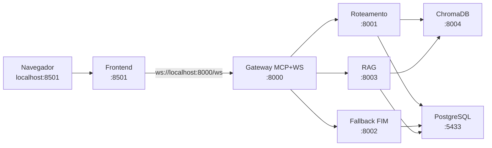

# Assistente Acadêmico Inteligente

## Problema abordado

O Assistente Acadêmico Inteligente é um sistema desenvolvido para auxiliar estudantes, professores e servidores no acesso rápido e automatizado às informações acadêmicas da pós-graduação do DCC.

O sistema utiliza documentos institucionais oficiais como base de conhecimento, permitindo responder perguntas relacionadas a:

- Regulamentos dos programas do PPGCC;
- Instruções Normativas (IN’s);
- Resoluções;
- Formulários acadêmicos;
- Rotinas acadêmicas ;

A proposta busca reduzir o tempo gasto na busca manual por informações e facilitar o acesso às normas e rotinas acadêmicas de forma centralizada, inteligente e acessível.

---

## Tecnologias utilizadas

- **Linguagem**: Python 3.14.5
- **Bibliotecas**:
    - Ollama v0.23.1
    - Langchain
    - FastMCP v3.3.1
- **Banco de dados**:
    - **Vetorial**: ChromaDB 1.5.9
    - **Relacional**: PostgreSQL 18.4
- **Frontend**: Streamlit 1.57.0

---

## Arquitetura do sistema


---

## Componentes

### Interface

**Usuário** — Pessoa que usa o chatbot. Envia a pergunta em texto livre e lê a resposta na tela.

**Frontend** — Aplicação com a qual o usuário conversa. Mostra o histórico da conversa, envia a pergunta ao MCP e exibe a resposta recebida.


### Gateway

**MCP** — Camada entre o frontend e os microsserviços. O frontend só fala com o MCP. O MCP recebe a pergunta, decide qual microsserviço chamar (após o roteamento) e devolve a resposta ao frontend. Os microsserviços não são expostos diretamente à interface.


### Microsserviço de roteamento

Responsável por classificar a pergunta antes do tratamento definitivo. O resultado é **FIM** (resposta pronta, sem buscar normas) ou **RAG** (precisa consultar as normas indexadas).

- **Embedding** — Converte a pergunta em vetor numérico. Esse vetor é comparado com exemplos de perguntas já classificadas como FIM ou RAG, armazenados no banco vetorial.
- **Banco vetorial** — Contém os exemplos usados na classificação. Para cada pergunta nova, o serviço obtém o score de similaridade com cada rota e escolhe a de maior score como decisão.
- **Banco relacional** — Grava a pergunta, a decisão (FIM ou RAG) e dados de auditoria. Não armazena a resposta final ao usuário; serve para histórico e análise do roteamento.


### Microsserviço de resposta padrão

Atende perguntas classificadas como **FIM**: saudações, orientações genéricas, pedidos fora do escopo das normas ou casos com texto de resposta já definido.

- **Resposta padrão** — Componente que monta a resposta. Usa regras e templates definidos no próprio serviço (por exemplo, mensagem de boas-vindas ou aviso de escopo). O texto da resposta não é lido do banco relacional.
- **Banco relacional** — Grava a pergunta, a resposta enviada ao usuário e metadados da interação, para histórico e métricas do atendimento FIM.


### Microsserviço de RAG

Atende perguntas classificadas como **RAG**: o usuário quer informação baseada nas normas e documentos de pós-graduação da UFLA.

- **Embedding** — Gera o vetor da pergunta e busca no banco vetorial os trechos de normas mais próximos do sentido da pergunta.
- **Banco vetorial** — Armazena as normas e documentos já fragmentados e indexados. A busca retorna os trechos que serão usados como contexto na geração da resposta.
- **LLM** — Recebe a pergunta e os trechos encontrados, e produz a resposta em texto corrido para o usuário. É o único ponto da arquitetura em que a resposta é gerada por modelo de linguagem.
- **Banco relacional** — Grava a pergunta, a resposta gerada e metadados da interação, após a LLM concluir. Mesmo papel de histórico que nos demais microsserviços.

---

## Fluxo de dados (diagramas de sequência)

### Fluxo completo


### Roteamento


### RAG


### Resposta padrão


---

## Grupo

- Lívia Della Garza Silva, 
- Eduardo Cesar Cauduro Coelho,
- Felipe Geraldo de Oliveira,
- Vitor Gabriel Firmino

---

## Arquitetura distribuída e portas

Cada componente roda em **processo/container separado**, com **porta própria** no host (`localhost`). O frontend fala **somente** com o gateway; o gateway orquestra os microsserviços pela rede interna do Docker.



| Componente | URL no host (desenvolvimento) | Rede Docker (entre containers) |
|------------|-------------------------------|--------------------------------|
| Frontend (Streamlit) | http://localhost:8501 | `frontend:8501` |
| Gateway (MCP + WebSocket) | http://localhost:8000 — WS: `ws://localhost:8000/ws` | `gateway:8000` |
| Microsserviço Roteamento | http://localhost:8001 | `routing:8001` |
| Microsserviço Fallback (FIM) | http://localhost:8002 | `fallback:8002` |
| Microsserviço RAG | http://localhost:8003 | `rag:8003` |
| ChromaDB | http://localhost:8004 | `chromadb:8000` |
| PostgreSQL | localhost:5433 | `postgres:5432` |

Os microsserviços **não** são chamados pelo navegador diretamente — apenas o gateway os acessa via HTTP interno.

---

## Dockerização e dependências por serviço

**Sim, dá para dockerizar tudo** — frontend, gateway, cada microsserviço e os bancos já têm imagem/container próprios.

**Sim, cada serviço pode ter dependências próprias.** Cada pasta em `src/services/<nome>/` contém:

- `Dockerfile` — imagem isolada
- `requirements.txt` — apenas o que aquele serviço precisa

| Serviço | Dependências principais |
|---------|-------------------------|
| `frontend` | Streamlit, websockets |
| `gateway` | FastMCP, FastAPI, httpx |
| `routing` | FastAPI, Chroma, LangChain (embeddings) |
| `fallback` | FastAPI, PostgreSQL |
Código compartilhado (`src/shared/`) é copiado apenas nos containers que precisam dele.

Cada serviço roda dentro da **própria imagem Docker** com ambiente Python isolado — não há venv compartilhado na raiz do repositório. Para desenvolver ou executar, use Docker (pipeline abaixo).

---

## Estrutura do código

```text
src/
├── shared/                    # biblioteca comum (config, models, db, llm)
├── indexing/                  # indexação de PDFs
├── scripts/                   # seed do Chroma (roteamento)
└── services/
    ├── frontend/            # Dockerfile + requirements.txt
    ├── gateway/
    ├── routing/
    ├── fallback/
    └── rag/
data/pdfs/                     # PDFs institucionais (entrada do indexer)
docker-compose.yml             # orquestra todos os containers
```

---

## Pipeline: construir e rodar (Docker)

Pré-requisitos: Docker e Docker Compose instalados.

### 1. Configuração inicial

```bash
cp .env.example .env
# Obrigatório: defina GEMINI_API_KEY no .env (obtenha em https://aistudio.google.com/apikey)
# Nunca commite o .env — ele já está no .gitignore
```

### 2. Build de todas as imagens

```bash
docker compose build
```

Constrói imagens independentes: `frontend`, `gateway`, `routing`, `fallback`, `rag` (+ jobs `seed` e `indexer` reutilizam imagens de routing/rag).

### 3. Subir infraestrutura (bancos)

```bash
docker compose up -d postgres chromadb
```

Aguarde o Postgres ficar healthy (`docker compose ps`).

### 4. Popular dados iniciais

```bash
# Exemplos FIM/RAG no Chroma (obrigatório para roteamento)
docker compose --profile tools run --rm seed

# Indexar PDFs (opcional — coloque arquivos em data/pdfs/ antes)
docker compose --profile tools run --rm indexer
```

### 5. Subir aplicação distribuída

```bash
docker compose up -d routing fallback rag gateway frontend
```

### 6. Verificar

```bash
docker compose ps
curl http://localhost:8000/health
curl http://localhost:8001/health
curl -X POST http://localhost:8001/classificar \
  -H 'Content-Type: application/json' \
  -d '{"pergunta":"olá"}'
```

Abrir o chat: **http://localhost:8501**

### 7. Parar tudo

```bash
docker compose down
# Remover volumes (dados dos bancos):
# docker compose down -v
```

### Atalho: subir stack completa de uma vez

```bash
docker compose up -d postgres chromadb \
  && docker compose --profile tools run --rm seed \
  && docker compose up -d routing fallback rag gateway frontend
```

### Build e run de um único microsserviço

```bash
# Exemplo: só o serviço de roteamento (com infra)
docker compose up -d postgres chromadb
docker compose build routing
docker compose up -d routing
curl http://localhost:8001/health
```

### Gemini (LLM e embeddings)

O Docker **exige** `GEMINI_API_KEY` no `.env`. Sem ela, `docker compose` falha na subida dos microsserviços.

Prioridade de LLM/embeddings:

1. Ollama (se `OLLAMA_ENABLED=true` e daemon acessível)
2. **Gemini** (se `GEMINI_API_KEY` definida — padrão do projeto)
3. Modo stub / HashEmbeddings (fallback)

Variáveis:

```bash
GEMINI_API_KEY=sua-chave-aqui
GEMINI_MODEL=gemini-2.0-flash
GEMINI_EMBED_MODEL=models/text-embedding-004
```

### Ollama (opcional)

Substitui Gemini quando o daemon local estiver ativo:

```bash
OLLAMA_ENABLED=true
OLLAMA_BASE_URL=http://host.docker.internal:11434
```