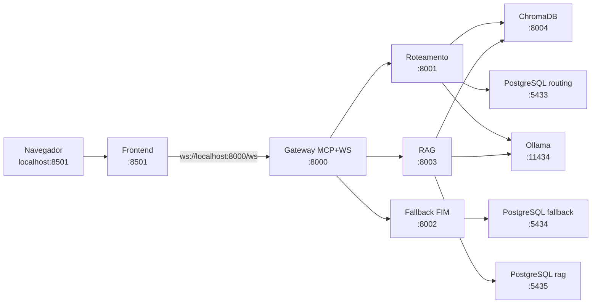

# Assistente Acadêmico Inteligente

## Problema abordado

O Assistente Acadêmico Inteligente é um sistema desenvolvido para auxiliar estudantes, professores e servidores no acesso rápido e automatizado às informações acadêmicas da pós-graduação do DCC.

O sistema utiliza documentos institucionais oficiais como base de conhecimento, permitindo responder perguntas relacionadas a:

- Regulamentos dos programas do PPGCC;
- Instruções Normativas (IN’s);
- Resoluções;
- Formulários acadêmicos;
- Rotinas acadêmicas ;

A proposta busca reduzir o tempo gasto na busca manual por informações e facilitar o acesso às normas e rotinas acadêmicas de forma centralizada, inteligente e acessível.

---

## Tecnologias utilizadas

- **Linguagem**: Python 3.14.5
- **Bibliotecas**:
    - Ollama v0.23.1
    - Langchain
    - FastMCP v3.3.1
- **Banco de dados**:
    - **Vetorial**: ChromaDB 1.5.9
    - **Relacional**: PostgreSQL 18.4
- **Frontend**: Streamlit 1.57.0

---

## Arquitetura do sistema


---

## Componentes

### Interface

**Usuário** — Pessoa que usa o chatbot. Envia a pergunta em texto livre e lê a resposta na tela.

**Frontend** — Aplicação com a qual o usuário conversa. Mostra o histórico da conversa, envia a pergunta ao MCP e exibe a resposta recebida.


### Gateway

**MCP** — Camada entre o frontend e os microsserviços. O frontend só fala com o MCP. O MCP recebe a pergunta, decide qual microsserviço chamar (após o roteamento) e devolve a resposta ao frontend. Os microsserviços não são expostos diretamente à interface.


### Microsserviço de roteamento

Responsável por classificar a pergunta antes do tratamento definitivo. O resultado é **FIM** (resposta pronta, sem buscar normas) ou **RAG** (precisa consultar as normas indexadas).

- **Embedding** — Converte a pergunta em vetor numérico. Esse vetor é comparado com exemplos de perguntas já classificadas como FIM ou RAG, armazenados no banco vetorial.
- **Banco vetorial** — Contém os exemplos usados na classificação. Para cada pergunta nova, o serviço obtém o score de similaridade com cada rota e escolhe a de maior score como decisão.
- **Banco relacional** — Grava a pergunta, a decisão (FIM ou RAG) e dados de auditoria no PostgreSQL **`routing`** (container `postgres-routing`). Não armazena a resposta final ao usuário.


### Microsserviço de resposta padrão

Atende perguntas classificadas como **FIM**: saudações, orientações genéricas, pedidos fora do escopo das normas ou casos com texto de resposta já definido.

- **Resposta padrão** — Componente que monta a resposta. Usa regras e templates definidos no próprio serviço (por exemplo, mensagem de boas-vindas ou aviso de escopo). O texto da resposta não é lido do banco relacional.
- **Banco relacional** — Grava a pergunta, a resposta enviada ao usuário e metadados no PostgreSQL **`fallback`** (container `postgres-fallback`).


### Microsserviço de RAG

Atende perguntas classificadas como **RAG**: o usuário quer informação baseada nas normas e documentos de pós-graduação da UFLA.

- **Embedding** — Gera o vetor da pergunta e busca no banco vetorial os trechos de normas mais próximos do sentido da pergunta.
- **Banco vetorial** — Armazena as normas e documentos já fragmentados e indexados. A busca retorna os trechos que serão usados como contexto na geração da resposta.
- **LLM** — Recebe a pergunta e os trechos encontrados via **Ollama** (`qwen3.5:0.8b`) e produz a resposta em texto corrido.
- **Banco relacional** — Grava a pergunta, a resposta gerada e trechos usados no PostgreSQL **`rag`** (container `postgres-rag`).

---

## Fluxo de dados (diagramas de sequência)

### Fluxo completo


### Roteamento


### RAG


### Resposta padrão


---

## Grupo

- Lívia Della Garza Silva, 
- Eduardo Cesar Cauduro Coelho,
- Felipe Geraldo de Oliveira,
- Vitor Gabriel Firmino

---

## Arquitetura distribuída e portas

Cada componente roda em **processo/container separado**, com **porta própria** no host (`localhost`). O frontend fala **somente** com o gateway; o gateway orquestra os microsserviços pela rede interna do Docker.



| Componente | URL no host (desenvolvimento) | Rede Docker (entre containers) |
|------------|-------------------------------|--------------------------------|
| Frontend (Streamlit) | http://localhost:8501 | `frontend:8501` |
| Gateway (MCP + WebSocket) | http://localhost:8000 — WS: `ws://localhost:8000/ws` | `gateway:8000` |
| Microsserviço Roteamento | http://localhost:8001 | `routing:8001` |
| Microsserviço Fallback (FIM) | http://localhost:8002 | `fallback:8002` |
| Microsserviço RAG | http://localhost:8003 | `rag:8003` |
| ChromaDB | http://localhost:8004 | `chromadb:8000` |
| PostgreSQL (routing) | localhost:5433 | `postgres-routing:5432` |
| PostgreSQL (fallback) | localhost:5434 | `postgres-fallback:5432` |
| PostgreSQL (rag) | localhost:5435 | `postgres-rag:5432` |
| Ollama | http://localhost:11434 | `ollama:11434` |

Os microsserviços **não** são chamados pelo navegador diretamente — apenas o gateway os acessa via HTTP interno.

---

## Dockerização e dependências por serviço

**Sim, dá para dockerizar tudo** — frontend, gateway, cada microsserviço e os bancos já têm imagem/container próprios.

**Sim, cada serviço pode ter dependências próprias.** Cada pasta em `src/services/<nome>/` contém:

- `Dockerfile` — imagem isolada
- `requirements.txt` — apenas o que aquele serviço precisa

| Serviço | Dependências principais |
|---------|-------------------------|
| `frontend` | Streamlit, websockets |
| `gateway` | FastMCP, FastAPI, httpx |
| `routing` | FastAPI, Chroma, LangChain, Ollama (embeddings) |
| `fallback` | FastAPI, PostgreSQL |
| `rag` | FastAPI, Chroma, LangChain, Ollama (embeddings + chat) |

Código compartilhado (`src/shared/`) é copiado apenas nos containers que precisam dele.

Cada serviço roda dentro da **própria imagem Docker** com ambiente Python isolado — não há venv compartilhado na raiz do repositório. Para desenvolver ou executar, use Docker (pipeline abaixo).

---

## Estrutura do código

```text
src/
├── shared/                    # biblioteca comum (config, models, db, llm)
├── indexing/                  # indexação de MD/PDF + chunking estrutural
├── scripts/                   # seed do Chroma (roteamento)
└── services/
    ├── frontend/            # Dockerfile + requirements.txt
    ├── gateway/
    ├── routing/
    ├── fallback/
    └── rag/
data/md/                       # normas em Markdown (entrada principal do indexer)
data/pdfs/                     # PDFs institucionais (entrada alternativa)
docker/                        # scripts auxiliares (ex.: pull de modelos Ollama)
docker-compose.yml             # orquestra todos os containers
```

---

## Pipeline: construir e rodar (Docker)

Pré-requisitos: **Docker** e **Docker Compose** instalados. **RAM recomendada: 8 GB+** (ideal 12 GB).

### Comandos completos (do zero)

```bash
cd ~/Documents/Trabalho-Pratico-Sistemas-Distribuidos

cp .env.example .env

docker compose down -v --remove-orphans
docker compose build

# Imagem do Ollama é grande (~2 GB) — espere terminar antes de continuar
docker pull ollama/ollama:latest

docker compose up -d ollama postgres-routing postgres-fallback postgres-rag chromadb
sleep 15

docker compose --profile tools run --rm ollama-pull
docker compose --profile tools run --rm seed
docker compose --profile tools run --rm indexer

docker compose up -d routing fallback rag gateway frontend
docker compose ps
```

**Interface do chat:** http://localhost:8501

---

### Passo a passo

#### 1. Configuração inicial

```bash
cp .env.example .env
```

#### 2. Build das imagens

```bash
docker compose build
```

#### 3. Baixar imagem do Ollama

```bash
docker pull ollama/ollama:latest
```

O `docker compose up` também tenta baixar, mas é mais confiável rodar o `pull` separado e **esperar concluir** (várias camadas; `Pull complete` em uma camada não significa que terminou tudo).

#### 4. Subir infraestrutura

```bash
docker compose up -d ollama postgres-routing postgres-fallback postgres-rag chromadb
sleep 15
docker compose ps
```

Aguarde os três Postgres ficarem `healthy`.

#### 5. Modelos Ollama e dados iniciais

```bash
docker compose --profile tools run --rm ollama-pull
docker compose --profile tools run --rm seed
docker compose --profile tools run --rm indexer
```

| Job | Função |
|-----|--------|
| `ollama-pull` | Baixa `qwen3-embedding:0.6b` no container Ollama (volume Docker) |
| `seed` | Popula exemplos FIM/RAG no Chroma (roteamento) |
| `indexer` | Indexa normas de `data/md/` (e PDFs em `data/pdfs/`) |

#### 6. Subir aplicação

```bash
docker compose up -d routing fallback rag gateway frontend
```

#### 7. Verificar

```bash
docker compose ps
curl http://localhost:8000/health
curl http://localhost:8001/health
curl -X POST http://localhost:8001/classificar \
  -H 'Content-Type: application/json' \
  -d '{"pergunta":"olá"}'
```

#### 8. Parar

```bash
docker compose down
# Apagar volumes (bancos + modelos Ollama):
# docker compose down -v
```

---

### Já subiu antes?

Se imagens, modelos e índices já existem:

```bash
docker compose up -d
```

---

### Build de um único microsserviço

```bash
docker compose up -d postgres-routing chromadb ollama
docker compose build routing
docker compose up -d routing
curl http://localhost:8001/health
```

### Modelos (Ollama + Gemini)

| Papel | Provedor | Modelo |
|-------|----------|--------|
| Embeddings | Ollama (container Docker) | `qwen3-embedding:0.6b` (~640 MB) |
| Chat (RAG) | Gemini API | `gemini-2.0-flash` |

O job `ollama-pull` baixa o modelo de embedding **no volume do container Ollama**, não no host. Configure `GEMINI_API_KEY` no `.env` para respostas do RAG.

Variáveis:

```bash
OLLAMA_ENABLED=true
OLLAMA_BASE_URL=http://ollama:11434   # dentro do Docker
OLLAMA_EMBED_MODEL=qwen3-embedding:0.6b
GEMINI_API_KEY=sua-chave-aqui
GEMINI_MODEL=gemini-2.0-flash
```

Baixar embedding manualmente (no container Ollama):

```bash
docker compose exec ollama ollama pull qwen3-embedding:0.6b
```

### Chunking estrutural (RAG)

O indexer divide normas por **Art., Artigo, §, Capítulo** e cabeçalhos Markdown antes de indexar no Chroma. Trechos grandes são subdivididos mantendo metadados da seção (`secao`, `chunk_type`).

### Bancos PostgreSQL (um por microsserviço)

| Microsserviço | Banco | Porta host |
|---------------|-------|------------|
| routing | `routing` | 5433 |
| fallback | `fallback` | 5434 |
| rag | `rag` | 5435 |

Consultar auditoria:

```bash
# Routing
docker compose exec postgres-routing psql -U academic -d routing \
  -c "SELECT id, pergunta, decisao, score FROM routing_logs ORDER BY id DESC LIMIT 5;"

# Fallback
docker compose exec postgres-fallback psql -U academic -d fallback \
  -c "SELECT id, pergunta, template_id FROM fim_interactions ORDER BY id DESC LIMIT 5;"

# RAG
docker compose exec postgres-rag psql -U academic -d rag \
  -c "SELECT id, left(pergunta, 50), left(resposta, 80) FROM rag_interactions ORDER BY id DESC LIMIT 5;"
```